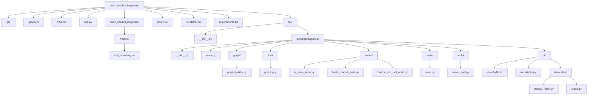

# 🚀 Basic LangGraph Chatbot (with Tools)

A Streamlit-based, agentic chatbot application built using **LangGraph** and **LangChain**, designed to demonstrate how conversational AI systems can be structured as **graph-based workflows** rather than linear chains.

The application supports multiple conversational modes within a unified architecture:
- **Basic Chatbot** – A lightweight, LLM-only conversational agent for general-purpose interactions.
- **Chatbot with Tavily Search** – A tool-augmented chatbot that dynamically invokes Tavily Search to retrieve real-time information, enabling more accurate and grounded responses.
- **AI News Fetcher & Summarizer** – An automated agent that fetches the latest AI-related news using Tavily and generates concise, readable summaries using a Groq-powered LLM.

Each capability is implemented as an independent **LangGraph node**, operating over a shared state and orchestrated through a configurable graph. This modular design ensures clear separation of concerns between UI, agent logic, tools, and LLM configuration, while making the system easy to extend with new tools, agents, or workflows without impacting existing functionality.


---

## ✨ Features

- **Modular Architecture** — Clear separation of UI, graph logic, nodes, and model configs  
- **LangGraph Integration** — Build agent workflows using nodes & edges  
- **Dynamic Streamlit UI** — Select LLM provider, model, use case, and enter API keys  
- **Supports Multiple LLM Models** — LLaMA 3, Mixtral, and more  
- **Easy to Extend** — Add new use cases, nodes, or tool-enabled agents  

---
## 🛠️ Installation & Setup

### 1️⃣ Clone the repository
```bash
git clone https://github.com/<your-username>/basic_chatbot_langchain.git  
cd basic_chatbot_langchain
```

---
### 2️⃣ Create a virtual environment

**Option A — Using Conda**
```bash 
conda create -p venv python=3.13  
conda activate ./venv
```

**Option B — Using Python venv**
```bash 
python -m venv venv
``` 

**Activate the environment:**
```bash
Windows: venv\Scripts\activate  
Mac/Linux: source venv/bin/activate
```

---

### 3️⃣ Install dependencies
```bash
pip install -r requirements.txt
```

---

### 4️⃣ Run the Streamlit app
```bash
streamlit run app.py
```

---

## 🏗️ Project Structure

