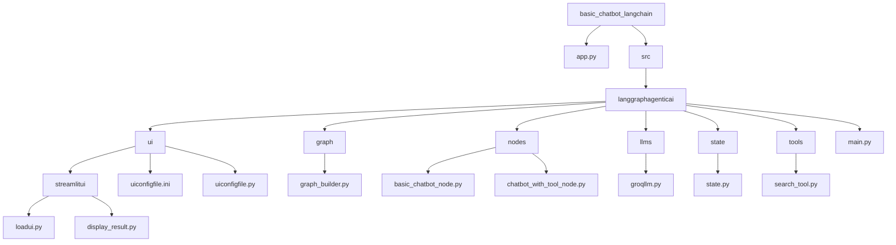

# 🚀 Basic LangGraph  (with Tools) — Streamlit Application

A modular and extensible chatbot application built using:

- **LangGraph** – for agent workflows  
- **LangChain** – for LLM orchestration  
- **Streamlit** – for the UI  
- **Groq** – fast, free LLM inference  
- **Tools (optional)** – extend the chatbot with additional actions  

This project demonstrates how to build a basic chatbot using a graph-based pipeline that processes user messages through a configurable LLM setup.

---

## ✨ Features

- **Modular Architecture** — Clear separation of UI, graph logic, nodes, and model configs  
- **LangGraph Integration** — Build agent workflows using nodes & edges  
- **Dynamic Streamlit UI** — Select LLM provider, model, use case, and enter API keys  
- **Supports Multiple LLM Models** — LLaMA 3, Mixtral, and more  
- **Easy to Extend** — Add new use cases, nodes, or tool-enabled agents  

---
## 🛠️ Installation & Setup

### 1️⃣ Clone the repository
```bash
git clone https://github.com/<your-username>/basic_chatbot_langchain.git  
cd basic_chatbot_langchain
```

---
### 2️⃣ Create a virtual environment

**Option A — Using Conda**
```bash 
conda create -p venv python=3.13  
conda activate ./venv
```

**Option B — Using Python venv**
```bash 
python -m venv venv
``` 

**Activate the environment:**
```bash
Windows: venv\Scripts\activate  
Mac/Linux: source venv/bin/activate
```

---

### 3️⃣ Install dependencies
```bash
pip install -r requirements.txt
```

---

### 4️⃣ Run the Streamlit app
```bash
streamlit run app.py
```

---

## 🏗️ Project Structure

